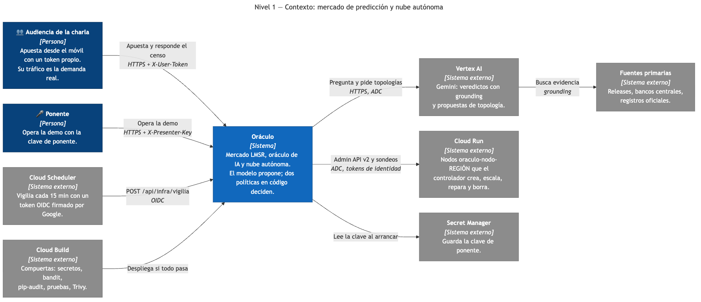

# Oráculo — mercado de predicción en vivo

Demo para charla. La audiencia opera un mercado de predicción desde el móvil y
los precios son probabilidades. Un oráculo de IA intenta resolver cada pregunta
buscando en la web, y el código decide si acepta su veredicto. Todo corre en
Google Cloud.

La demo tiene tres partes. Se pueden dar por separado o juntas:

1. **Creencia contra evidencia.** La sala agrega lo que cree; el oráculo busca
   evidencia; una política en código decide si esa evidencia alcanza.
2. **Encuadre.** El mismo hecho, contado con dos titulares. La sala se divide
   al azar y se mide cuánto la movió el titular. Después se le muestran los dos
   titulares al modelo y el código exige que su veredicto no dependa de ellos.
3. **Nube autónoma.** Bucles que actúan sobre Cloud Run de verdad: despliegan la
   topología que propone un modelo, escalan con el tráfico de los móviles,
   reparan fallas reales y tienen un mercado real de agentes con precios del
   catálogo de Cloud Billing. Un laboratorio simulado de doce agentes muestra
   las mismas técnicas a cámara rápida.

Demo desplegada: https://oraculo-api-346171942822.us-east1.run.app (proyecto
`oraculo-6d1578`).

## Contenido

- [Las tres pantallas](#las-tres-pantallas)
- [Qué predice cada pregunta](#qué-predice-cada-pregunta)
- [Encuadre: noticias, opinión y modelos](#encuadre-noticias-opinión-y-modelos)
- [La nube autónoma](#la-nube-autónoma)
- [Qué afirmar desde el escenario](#qué-afirmar-desde-el-escenario)
- [Preparar la charla](#preparar-la-charla)
- [Qué hay dentro](#qué-hay-dentro)
- [Arranque local](#arranque-local)
- [Decisiones de diseño](#decisiones-de-diseño)
- [Publicar en Google Cloud](#publicar-en-google-cloud)
- [Seguridad](#seguridad)

## Las tres pantallas

| Pantalla | Quién la ve | Qué muestra |
| --- | --- | --- |
| `/` | La audiencia, en el móvil | Las preguntas, el precio y los botones para apostar. El titular que le tocó a esa persona, si la pregunta tiene encuadre. El censo privado, si la pregunta es de la sala |
| `/proyeccion.html` | Todos, en el proyector | Cada mercado, su precio, quién lo resuelve y la línea «la sala decía X; el juez dice Y». En preguntas con encuadre: qué apostó cada grupo y, al revelar, los dos titulares |
| `/nube.html` | El ponente, en el proyector | La infraestructura real, el mercado real, la política de actuación, los incidentes y el laboratorio simulado (incluidas noticias y credulidad) |

Los controles del ponente solo aparecen si la URL termina en `#clave=…`. Sin la
clave, las tres pantallas funcionan como vistas de solo lectura. Cada pantalla
tiene ayuda al pasar el cursor, y `/nube.html` una guía plegable y una pista que
cambia con el estado.

## Qué predice cada pregunta

Cada mercado declara su tipo (`kind`), porque el tipo cambia lo que mide el
precio:

| Tipo | Ejemplo | Qué mide el precio | Quién lo resuelve |
| --- | --- | --- | --- |
| `presente` | ¿Salió Python 3.15.0 antes del 15/10/2026? | La respuesta ya existe, pero nadie en la sala la sabe con certeza. El precio agrega conocimiento disperso **sobre el presente**: Hayek, no Hanson | El oráculo, con evidencia |
| `futuro` | ¿Cerrará el USD/DOP sobre 65 el 31/12/2026? | Hoy no se puede resolver, a propósito: lo correcto es que el oráculo diga **SIN RESOLVER** | El oráculo, que debe negarse |
| `sala` | ¿Más de la mitad de esta sala desplegó un viernes este mes? | Cada asistente conoce una parte y ningún buscador la tiene. Aquí el mecanismo de agregación se luce | Un censo privado de la sala |
| `simulacion` | ¿La primera caída de nodo se reparará en menos de 6 ticks? | Comportamiento emergente de los agentes: un futuro de verdad, con plazo de minutos | El código de la simulación |
| `simulacion` con predicado real | ¿La primera falla en un nodo real de Cloud Run se reparará en menos de 2 minutos? | Lo mismo, sobre infraestructura real | Lo medido en Cloud Run (`InfraController`) |

Una pregunta `presente` o `futuro` puede llevar además un **encuadre**: dos
titulares sobre el mismo hecho (ver la sección siguiente).

Las preguntas `presente` se pueden buscar en Google, así que en el fondo son una
carrera entre la corazonada de la sala y un buscador. La interfaz pide que nadie
busque. Si alguien lo hace, también sirve: esa persona se convierte en el
buscador y el precio se mueve con su información.

### El LLM como componente no confiable

Casi todos los demos de LLM muestran un modelo que produce algo y piden confiar
en el resultado. Este hace lo contrario: el modelo está detrás de un puerto
(`OracleGateway`) y una compuerta en código (`AcceptancePolicy`) decide si el
veredicto vale. El momento más instructivo de la charla es cuando el sistema se
niega a responder.

Para provocar esas negativas en el escenario, la proyección tiene un selector de
fallos:

| Fallo | Qué simula | Qué lo rechaza |
| --- | --- | --- |
| `baja_confianza` | El modelo responde con confianza 0.55 | `AcceptancePolicy`: confianza < `ORACLE_MIN_CONFIDENCE` |
| `un_dominio` | El grounding trae fuentes de un solo dominio | `AcceptancePolicy`: dominios < `ORACLE_MIN_SOURCES` |
| `json_malformado` | El modelo responde en prosa | `interpret`: fail-closed al no poder parsear |
| `red_caida` | Falla la llamada a Vertex AI | `run`: fail-closed ante cualquier excepción |
| `noticia_como_verdad` | El pipeline le pasa el titular al modelo como hecho verificado (solo preguntas con encuadre) | `FramingPolicy`: el veredicto cambia con el titular |

Los cuatro primeros se inyectan en la respuesta cruda, antes de `interpret`, que
es el mismo código que lee a Vertex AI. Lo que la sala ve rechazar es la ruta de
producción, no una simulación aparte. Cada consulta queda en `attempts`, con su
fallo, el precio de la sala en ese momento y el motivo del rechazo.

## Encuadre: noticias, opinión y modelos

En internet hay miles de noticias sobre cualquier hecho, y la opinión se mueve
según cómo están escritas. A los modelos les pasa lo mismo: leen esas noticias.
Esta parte lo muestra en tres piezas, de la más real a la más simulada.

### 1. La sala, dividida al azar

Una pregunta con encuadre lleva dos titulares sobre el mismo hecho: uno empuja
hacia el SÍ y otro hacia el NO. Cada persona ve solo uno, encima de la pregunta,
en su móvil.

- **Asignación:** aleatorización en bloques. El grupo más chico recibe a la
  siguiente persona; si están empatados, decide un hash del nombre. Los grupos
  nunca se separan por más de una persona, y nadie elige su grupo.
- **Qué se mide:** por grupo, cuántas personas vieron el titular, cuántas
  apostaron y qué parte del dinero fue al SÍ. Solo agregados: nunca quién vio
  qué.
- **Qué ve la proyección:** los dos grupos y su diferencia, en vivo. Los
  titulares quedan **ocultos** hasta que el ponente pulsa «Revelar titulares»
  o hasta que se resuelve: la proyección la ve toda la sala, y mostrarlos antes
  arruinaría el experimento.

Como la asignación es al azar, en esa sala la diferencia entre grupos la causó
el titular y no quién es cada grupo. Las otras preguntas solo muestran
correlación. Con ochenta personas puede ser ruido, y la proyección lo dice.

### 2. El modelo, puesto a prueba con los mismos titulares

Al consultar al oráculo sobre una pregunta con encuadre, el código lo consulta
tres veces: sin titular, con el pro-SÍ y con el pro-NO. `FramingPolicy` acepta
el veredicto solo si las tres lecturas coinciden. Si el modelo cambia de opinión
con el titular, queda SIN RESOLVER, porque los hechos eran los mismos.

- El titular llega al modelo como **dato no confiable**, dentro de `<noticia>`,
  y el prompt le dice que su tono no es evidencia.
- El fallo `noticia_como_verdad` enseña el error típico de un pipeline: sube la
  noticia a instrucción de sistema como «noticia verificada». El oráculo
  simulado la cree y responde hacia donde empuja; la política lo detecta.
- Si la lectura neutral no decide, no se gastan las otras dos.
- Cuesta tres llamadas a Gemini por resolución, solo cuando el ponente consulta.

Es el mismo patrón del resto del proyecto, *el modelo propone, el código
dispone*, aplicado ahora a la manipulación por redacción.

### 3. Credulidad en el laboratorio (simulado)

Los agentes del laboratorio tienen un gen más, `credulidad`. Cada 10 ticks llega
una noticia alarmista («se viene un pico») que acierta el 30 % de las veces.
Mientras está fresca, cada agente infla su previsión según su credulidad:
enciende capacidad y sube precios antes de ver los datos. El ponente puede
publicar un **rumor alarmista** falso con un botón. La evolución decide si creer
paga, y la sala apuesta: «¿al cerrar la generación 5, los agentes serán menos
crédulos que al empezar?».

Lo que enseña sin que nadie lo programe: no hay una respuesta fija. En 20
semillas, la credulidad bajó en 9 y subió en 11. Un rumor que todos creen a
veces sube los precios y a veces los baja, porque los crédulos también encienden
más capacidad. Es un parámetro, no un modelo de opinión pública, y la tarjeta lo
dice.

### Titulares: la regla de honestidad

Los titulares del juego `encuadre` son **titulares de ensayo**, escritos para la
demo y marcados así en pantalla. Antes de una charla, cámbialos por titulares
reales con su enlace (`https` obligatorio). Nunca atribuyas a un medio un
titular que no publicó. Para crear una pregunta con encuadre:

```bash
curl -X POST $URL/api/markets -H "X-Presenter-Key: $PRESENTER_KEY" -H 'Content-Type: application/json' -d '{
  "question": "¿Se publicó Python 3.15.0 (versión final) antes del 15 de octubre de 2026?",
  "criteria": "SÍ si python.org muestra la release 3.15.0 final con fecha igual o anterior al 15/10/2026.",
  "framing": {
    "pro_si": {"text": "…", "source": "Medio A", "url": "https://…"},
    "pro_no": {"text": "…", "source": "Medio B", "url": "https://…"}
  }
}'
```

## La nube autónoma

`/nube.html` muestra una nube que intenta gobernarse sola. La visión completa
(infraestructura que se auto-gobierna, se auto-optimiza y se auto-repara en un
mercado descentralizado) es mucho más grande de lo que cabe en una charla, y
casi todo en ella es todavía investigación. Cada pieza está en su versión más
pequeña que todavía es honesta, y la interfaz dice cuál es:

| La visión pide | Real (con `INFRA_MODE=real`) | Laboratorio simulado | Lo que **no** es |
| --- | --- | --- | --- |
| Predecir la demanda y ajustar la oferta | Holt predice las peticiones por segundo de la sala y fija las instancias mínimas de los nodos | Holt-Winters con autoescalado por agente | No es un modelo profundo; la demanda son los móviles de la sala |
| Descubrir estrategias de precios | Q-learning sobre la ganancia real de cada agente (ingreso a tiempo menos costo real de Cloud Run) | Lo mismo con doce agentes | No es RL profundo: pocos estados y 3 acciones |
| Formar coaliciones | Contratos que exigen dos regiones, ejecutados de verdad, pagados solo si cumplen, repartidos por Shapley exacto | Lo mismo con cpu simulada | La formación es codiciosa, no un equilibrio negociado |
| Evolucionar | El gen `warm` cambia la instancia mínima real; la aptitud es la ganancia real | Algoritmo genético con margen, reserva, cooperación, previsión y credulidad, contra la dinámica del replicador | No se reescriben a sí mismos: evolucionan unos pocos parámetros |
| Detectar y reparar fallas | Sondeos con token de identidad; detector EWMA; la reparación despliega una revisión sana | Lo mismo sobre nodos ficticios | La falla real se inyecta (`NODO_FALLA`), no es espontánea |
| Generar arquitecturas | La topología adoptada se despliega como `oraculo-nodo-<región>` tras pasar `ActuationPolicy` | Gemini y un algoritmo genético proponen; `TopologyPolicy` decide | El modelo nunca llama a la nube |
| Mercado de recursos | Subasta de precio uniforme de la demanda real entre 4 agentes, con tope de 12 peticiones por ciclo | Subasta por recurso entre doce agentes | **No es descentralizado**: hay un subastador central. El dinero es contable |
| Reaccionar a noticias | — | Gen `credulidad` y noticias alarmistas que aciertan el 30 % | Un parámetro, no un modelo de opinión |

El laboratorio existe porque una generación real dura unos 2 minutos (12 ciclos
de 10 s) y una simulada, 24 s. Además, sus fallas y su demanda se pueden
controlar, y es determinista dada la semilla (`SIM_SEED`), así que se puede
ensayar.

### La sala no decide la topología

Las preguntas sobre la nube son **apuestas sobre lo que va a pasar**, no
palancas. La topología cambia así:

1. El ponente pulsa «Pedir al modelo» o «Búsqueda evolutiva».
2. `TopologyPolicy` revisa el diseño: presupuesto, regiones, disponibilidad,
   latencia y forma. Si pasa y mejora la actual, se adopta.
3. `ActuationPolicy` revisa si se puede ejecutar en esta cuenta: regiones
   permitidas, 3 servicios como máximo, 2 instancias mínimas en total, 2
   máximas por región, un cambio de escala por minuto por región, 3 llamadas
   por ciclo, y solo servicios `oraculo-nodo-*` con la etiqueta
   `oraculo-demo=true`.
4. Solo entonces, con la actuación activa, se llama a Cloud Run.

Lo que sí hace la sala es **generar la demanda**: cada consulta de los móviles
es tráfico real que Holt predice y que los agentes se disputan.

La actuación arranca **en pausa**. `INFRA_MODE` puede ser `apagado` (el
predeterminado), `ensayo` (nube falsa en memoria), `plan` (Cloud Run valida
cada acción con `validateOnly` sin aplicarla) o `real`.

### El mercado real, con números

Los precios vienen de la API pública de Cloud Billing (precios de lista, sin
descontar el nivel gratuito). El 2026-10-05, en us-east1:

| Concepto | Costo |
| --- | --- |
| Una petición de trabajo (¼ vCPU, 256 MiB, redondeada a 100 ms) | 1,06 µUSD |
| Una hora con instancia mínima encendida | 0,45 centavos (0,63 en regiones de nivel 2) |
| Una hora de mercado con 12 peticiones cada 10 s y un agente caliente | ≈ 1 centavo |

Medido en producción el 2026-10-05: 5 minutos, 24 ciclos, 4 agentes.

| Agente | Región | Latencia real (p50) | Resultado |
| --- | --- | --- | --- |
| r1 | us-east1 | 14 ms | Gana: la misma región que la API |
| r2 | us-central1 | 55 ms | Gana menos |
| r3 | europe-west1 | 111 ms | Gana; mejor de la generación 2 |
| r4 | southamerica-east1 | 138 ms | Pagó instancia caliente en una región de nivel 2 y casi no vendió: −157 µUSD. En la generación 2, la evolución le apagó la instancia |

Los tres contratos de dos regiones se cumplieron (6 de 6 a tiempo); 468
peticiones, todas con 200; costo total 531 µUSD (0,05 centavos). Con el tráfico
de una sala, mantener una instancia caliente cuesta más de lo que se gana
evitando arranques en frío, y la evolución suele descubrirlo. No está
programado: es la economía real de Cloud Run.

### Lo que el laboratorio enseña sin que nadie lo programe

- **El margen se va a cero.** El Q-learning empuja los precios hacia el costo:
  competencia de Bertrand. Solo suben con escasez.
- **La cooperación no siempre sobrevive.** Con unas semillas los cooperativos
  dominan; con otras se extinguen en dos generaciones.
- **Predecir bien es difícil de demostrar.** Sin perturbaciones, Holt-Winters
  apenas le gana al pronóstico ingenuo. Con picos, la diferencia crece.
- **Creer noticias no siempre se castiga.** Con noticias que aciertan el 30 %,
  la credulidad sube o baja según la semilla.

## Qué afirmar desde el escenario

Con ochenta personas, dinero ficticio, cuarenta minutos y tres preguntas no se
puede sostener ninguna afirmación sobre la sabiduría de las multitudes, ni sobre
los medios, ni sobre nubes autónomas. Eso solo importa si haces la afirmación
equivocada:

| ✗ No digas | ✓ Di |
| --- | --- |
| «Miren, la multitud acertó» | «Así se ve un mecanismo de agregación. Ninguno sabía la respuesta y el precio se movió hacia ella» |
| «Los medios manipulan a las masas» | «El mismo hecho, con dos titulares, y esta sala apostó distinto. Al modelo le pasó lo mismo, y el código lo detectó» |
| «Esta nube se gobierna sola» | «Estos son los bucles que una nube autónoma necesitaría, en su forma más pequeña, y aquí es donde el código le dice que no al modelo» |

La proyección está construida para la columna derecha. Todos los mercados abren
en 50 %, sin órdenes de la casa, así que cualquier movimiento lo hizo la sala.
Al resolver, dice si el precio se había movido hacia la respuesta o en contra, y
nunca que «la multitud acertó».

### Límites del censo, para decirlos antes de que los pregunten

- El censo es autodeclarado y quien responde también apuesta: alguien puede
  mentir para ganar. Mitigación débil: una respuesta por persona, inmutable, y
  solo se publica el conteo.
- Con menos de 5 respuestas el censo se niega a resolver
  (`CENSUS_MIN_RESPONSES`), la misma idea que el mínimo de fuentes del oráculo.
- Los nombres no se autentican. Para una sala está bien; para otra cosa, no.

## Preparar la charla

### Elige las preguntas

Se eligen con `SEED_SET`. Varios juegos se combinan con `+` (por ejemplo,
`encuadre+nube_real`).

| `SEED_SET` | Preguntas | Charla |
| --- | --- | --- |
| `oraculo` (default) | Kubernetes, Python (`presente`) y USD/DOP (`futuro`) | Creencia contra evidencia, y el LLM como componente no confiable |
| `agregacion` | Tres preguntas `sala` sobre la práctica de la audiencia | El mecanismo de agregación: información dispersa que no se puede buscar |
| `mixta` | Python, USD/DOP y una pregunta `sala` | Un ejemplo de cada tipo |
| `encuadre` | Python y Kubernetes con dos titulares cada una, más una pregunta `sala` como control | Cómo un titular mueve a la sala y al modelo |
| `nube` | Cooperación, autorreparación, topología y credulidad (simuladas) | La nube autónoma; la sala apuesta sobre comportamiento emergente |
| `nube_real` | Cooperación, topología y credulidad (simuladas) más la autorreparación de un nodo real | La nube tocando infraestructura real. Necesita `INFRA_MODE=real` |

Para tus propias preguntas `sala`, busca algo que cada asistente sepa de sí
mismo y que nadie sepa del grupo: prácticas, hábitos, incidentes recientes.

### Guiones (≈ 40 min cada uno)

**`oraculo`: creencia contra evidencia**

1. **Apertura (5 min).** Proyecta `/proyeccion.html`; la audiencia entra en `/`.
   Explica los tipos con la tarjeta de cada mercado.
2. **Mercado abierto (15 min).** Señala cómo se mueve el precio, siempre como
   mecanismo y nunca como acierto.
3. **La negativa (5 min).** Consulta la pregunta `futuro`. Luego inyecta
   `baja_confianza` y `un_dominio` en una `presente` y lee la traza: el modelo
   propuso, el código rechazó.
4. **El contraste (5 min).** Consulta sin fallo. Lee «la sala decía X %, el
   oráculo dice Y con N fuentes».
5. **Cierre (10 min).** Qué *no* demuestra esto. Muestra
   [`app/domain/verdict.py`](app/domain/verdict.py) y sus tests.

**`encuadre`: noticias, opinión y modelos**

1. **Apertura (5 min).** La sala entra en `/`. No digas todavía que hay dos
   titulares; la pantalla dice que se revelan al final.
2. **Mercado abierto (10 min).** En la proyección, mira cómo se separan los dos
   grupos. Compara con la pregunta `sala`, que no tiene titular.
3. **La revelación (5 min).** «Revelar titulares». Lee los dos en voz alta y la
   diferencia entre grupos.
4. **El modelo lee lo mismo (10 min).** Consulta al oráculo: tres lecturas, y
   la política de encuadre las compara. Luego `noticia_como_verdad`: el pipeline
   le pasa el titular como hecho, el modelo cambia de opinión y el código se
   niega a resolver.
5. **Cierre (10 min).** La tabla de «qué afirmar». Si combinaste con `nube`, pasa
   a `/nube.html` y publica un rumor alarmista.

**`nube`: la nube simulada**

1. **Apertura (5 min).** Proyecta `/nube.html` en pausa y recorre las tarjetas:
   cada una dice qué técnica es y qué no es.
2. **Apuestas (5 min).** La audiencia apuesta en `/`. Inicia la simulación.
3. **Fallas (10 min).** Caída de nodo, pico de demanda y un rumor alarmista.
   Señala cuánto tarda el detector, los falsos positivos y qué hacen los
   crédulos.
4. **El modelo propone (10 min).** Pide topologías al modelo y a la búsqueda
   evolutiva. Lee la traza de un rechazo. El algoritmo genético suele ganarle
   al modelo: dilo en voz alta.
5. **Cierre (10 min).** Avanza hasta la generación 5 y resuelve desde
   `/proyeccion.html`.

**`nube_real`: la nube sobre Cloud Run**

1. **5 min antes.** Abre `/nube.html#clave=…` y confirma que «Infraestructura
   real» dice `modo real` sin errores. Sube la API a `--min-instances 1` (ver
   [Costos](#costos-qué-cobra-y-qué-no)).
2. **Apertura (5 min).** Explica las dos compuertas. La sala apuesta.
3. **El modelo propone (5 min).** «Pedir al modelo»: compara lo que el modelo
   *dice* de la latencia con lo que el código *mide*.
4. **La nube actúa (10 min).** «Activar actuación»: el primer ciclo crea nodos y
   agentes (unos 30 s). Señala quién vende, a qué latencia real, cuánto cuesta y
   quién paga una instancia caliente sin que le convenga.
5. **La falla real (10 min).** Cuando la pista diga «Listo para una falla
   real», pulsa «caída». Unos 30 s hasta que el detector la ve y unos 20 s más
   hasta que Cloud Run despliega la revisión sana.
6. **Cierre (5 min).** Resuelve los mercados y pulsa **Apagar todo**.

## Qué hay dentro

Clean architecture: las dependencias apuntan hacia adentro y el centro no sabe
que existen FastAPI, Vertex AI ni la memoria del proceso.

```
app/
├── domain/              Reglas puras. No importa nada del proyecto ni de I/O.
│   ├── lmsr.py          Market maker automático (LMSR de Hanson)
│   ├── market.py        Market y Account: órdenes, censo, liquidación, grupos de encuadre
│   ├── verdict.py       Verdict, AcceptancePolicy y CensusPolicy
│   ├── framing.py       Titulares, asignación al azar, conteo por grupo y FramingPolicy
│   ├── errors.py
│   └── cloud/           La nube: laboratorio determinista y reglas del mercado real
│       ├── catalog.py   Recursos, regiones y zonas de usuarios
│       ├── forecast.py  Holt y Holt-Winters aditivo
│       ├── auction.py   Subasta de precio uniforme
│       ├── agents.py    Genoma (con credulidad), Q-learner y autoescalado de cada agente
│       ├── coalitions.py  Contratos y valor de Shapley
│       ├── anomaly.py   Detector EWMA con z-score
│       ├── evolution.py Algoritmo genético y dinámica del replicador
│       ├── topology.py  Evaluación, TopologyPolicy y búsqueda evolutiva
│       ├── infra.py     Plan de acciones y ActuationPolicy
│       ├── real_market.py  Precios, genoma, subasta, liquidación y evolución del mercado real
│       ├── predicates.py  Qué puede preguntar la sala y quién lo resuelve
│       └── simulation.py  El tick, las fallas, las noticias y el juez de los mercados
├── application/         Casos de uso y los puertos que necesitan.
│   ├── service.py       MarketService: crear, operar, censo, revelar, resolver (con prueba de encuadre)
│   ├── cloud.py         CloudService: correr, pausar, fallas, topologías, juez
│   ├── infra.py         InfraController: observar, predecir, sondear, reparar, actuar
│   ├── judges.py        Juez compuesto: simulación o infraestructura real
│   ├── real_market.py   RealMarket: subasta la demanda real, envía trabajo, liquida, evoluciona
│   ├── limits.py        Límites de ritmo contra abuso
│   ├── ports.py         OracleGateway, Repository, SimulationJudge, TopologyGenerator, …
│   ├── views.py         Lo que sale de un caso de uso (dicts planos)
│   └── errors.py        NotFound, Cooldown
├── adapters/            Implementaciones de los puertos.
│   ├── memory.py        Repository en memoria, con lock
│   ├── google_auth.py   Credenciales por defecto y tokens de identidad
│   ├── vertex_client.py generateContent, compartido
│   ├── infra/           Nodos y agentes: Cloud Run (Admin API v2) y nube de ensayo
│   ├── prices.py        Precios de Cloud Run: catálogo de Cloud Billing o foto fija
│   ├── topology/        Generadores de topologías: Vertex AI y simulado
│   └── oracle/
│       ├── gemini.py    Ruta común: run → inject_fault → interpret → política
│       ├── vertex.py    Gemini en Vertex AI con grounding; titulares como dato no confiable
│       └── mock.py      Simulado, con la misma forma de respuesta
├── entrypoints/http/    FastAPI: rutas, esquemas, clave de ponente y estáticos
│   └── static/          Tres pantallas con su JS aparte (CSP sin scripts en línea)
├── node.py              El nodo real: /salud (con NODO_FALLA) y /trabajo, lo que venden los agentes
├── config.py            Settings: el único que lee el entorno; falla cerrado en producción
├── seeds.py             Juegos de preguntas (SEED_SET)
└── main.py              Raíz de composición: conecta las capas
```

| Capa | Puede importar | No puede importar |
| --- | --- | --- |
| `domain` | solo `domain` | FastAPI, Pydantic, httpx, google, `os` |
| `application` | `domain` | lo mismo que `domain` |
| `adapters` | `domain`, `application` | `entrypoints` |
| `entrypoints` | `domain`, `application` | `adapters` |

[`tests/test_architecture.py`](tests/test_architecture.py) recorre los imports
con `ast` y falla si alguien rompe esta tabla. Los tests siguen las mismas
capas:

| Carpeta | Qué prueba | Cómo |
| --- | --- | --- |
| `tests/domain/` | LMSR, entidades, políticas (incluida la de encuadre), la asignación al azar, cada técnica de la nube, la simulación entera y la economía del mercado real | Python puro, sin dobles, semillas fijas |
| `tests/application/` | Casos de uso (las tres lecturas del oráculo, qué titular ve cada quien), el controlador de infraestructura y el mercado real | Oráculo, generadores y nube de ensayo falsos, reloj controlado |
| `tests/adapters/` | Grounding, cada fallo inyectado, dónde pone Vertex el titular, la Admin API de Cloud Run y el catálogo de precios | Payloads grabados y SKUs reales en `fixtures/`, sin red |
| `tests/entrypoints/` | API de punta a punta, incluidas `/api/infra`, `revelar` y los juegos de preguntas | `TestClient` con el oráculo simulado y la nube de ensayo |
| `tests/security/` | Cada control de [SECURITY.md](SECURITY.md) | Recorre las rutas y los archivos estáticos |
| `tests/test_docs.py` | Que `docs/ARQUITECTURA.md` coincida con los `.mmd` y que los enlaces locales existan | Sin red |

## Arranque local

Requiere Python 3.12 o superior.

```bash
python -m venv .venv
source .venv/bin/activate          # Windows: .venv\Scripts\activate
pip install --require-hashes -r requirements.lock   # solo versiones fijadas, verificadas por hash
pip install -r requirements-dev.txt
pre-commit install                 # controles de seguridad antes de cada commit
cp .env.example .env

pytest -q
uvicorn app.main:app --reload --port 8080
```

- Audiencia: http://localhost:8080
- Proyección: http://localhost:8080/proyeccion.html
- Nube autónoma: http://localhost:8080/nube.html

Para ensayar:

- Sin `GOOGLE_CLOUD_PROJECT`, el oráculo usa el adaptador simulado: no toca la
  red y devuelve veredictos deterministas. `ORACLE_MOCK_FORCE=YES|NO|UNRESOLVED`
  fija el veredicto.
- `SIM_TICK_SECONDS=0.1` acelera el laboratorio: una generación en 2,4 s.
- `SEED_SET=encuadre` y dos pestañas privadas con nombres distintos: cada una
  ve un titular.
- La parte real sin tocar Google Cloud, con la nube de ensayo en memoria (se
  comporta como Cloud Run: los cambios tardan un par de ciclos y las fallas se
  ven en los sondeos):

  ```bash
  SEED_SET=nube_real INFRA_MODE=ensayo INFRA_INTERVALO=2 INFRA_RPS_POR_INSTANCIA=1 \
    uvicorn app.main:app --port 8080
  ```

  Abre `/nube.html`, activa la actuación y deja `/` abierta en otra pestaña para
  generar demanda. `INFRA_MODE=plan` es el paso siguiente: habla con Cloud Run
  de verdad, pero con `validateOnly`.

En VS Code, F5 arranca la API con recarga y el panel de pruebas descubre la
suite.

### Clave de ponente

Crear, revelar y resolver mercados es tarea del ponente. Si defines
`PRESENTER_KEY`, esas rutas exigen la cabecera `X-Presenter-Key`, y las vistas
la leen del fragmento de la URL: `https://tu-servicio/proyeccion.html#clave=TU_CLAVE`.
El fragmento no viaja al servidor ni queda en los logs. Sin `PRESENTER_KEY`, en
local no se exige nada. **En Cloud Run, defínela siempre.**

### Conectar Vertex AI

```bash
gcloud auth application-default login
gcloud services enable aiplatform.googleapis.com --project TU_PROYECTO
```

Luego `GOOGLE_CLOUD_PROJECT=TU_PROYECTO` y `ORACLE_BACKEND=vertex` en `.env`. No
hay llave de API: se usan las credenciales por defecto del entorno (en Cloud
Run, la cuenta de servicio).

## Decisiones de diseño

**El modelo propone, el código dispone.** `AcceptancePolicy` exige confianza
mínima y al menos dos dominios independientes, y falla cerrado ante un error de
red, JSON malformado o un resultado desconocido. `FramingPolicy` añade que el
veredicto no dependa del titular. Un `UNRESOLVED` deja el mercado abierto.

**Una sola ruta de interpretación.** Vertex AI y el simulado devuelven el mismo
formato de `generateContent` y pasan por `run → inject_fault → interpret →
AcceptancePolicy`. No agregues lógica de aceptación en un adaptador: si algo no
está en la ruta común, el ensayo deja de probar lo que se usa en producción.

**La evidencia no la escribe el modelo.** Sale de `groundingMetadata`. Los `uri`
de los grounding chunks son redirecciones que comparten host, así que el dominio
real se lee del campo `domain`. Hay un test que lo fija; no lo borres.

**Un titular no es evidencia.** Llega al modelo dentro de `<noticia>`, en el
turno del usuario, marcado como dato no confiable. Nunca en la instrucción de
sistema (eso es exactamente el fallo `noticia_como_verdad`).

**El experimento de encuadre no expone a nadie.** La asignación vive en el
mercado y solo salen agregados por grupo. Los titulares no se publican hasta
revelar o resolver.

**El censo no pasa por el oráculo.** Las preguntas `sala` se resuelven con
`CensusPolicy` (mínimo de respuestas). Solo se publica `census_count`.

**Los umbrales se inyectan.** `config.py` lee el entorno y `main.py` construye
las políticas. El dominio recibe números. La única excepción es
`ORACLE_MOCK_FORCE`, que el simulado lee en cada llamada.

**Los mercados abren en 50 %.** Antes se sembraban órdenes de la casa, pero eso
contaminaba la única afirmación honesta («el precio se movió»).

**El estado vive en memoria.** Sin base de datos y con `max-instances=1`: el
mercado dura 40 minutos. Para sobrevivir a un reinicio bastaría un adaptador de
Firestore que implemente `Repository`.

**Nada corre en segundo plano.** El laboratorio calcula en cada petición los
ticks que tocan (hasta 50). El controlador de infraestructura corre un ciclo
dentro de `GET /api/infra` cada 10 s. Así la API usa facturación por petición y
escala a cero.

**Los nodos olvidados son el único gasto que no se apaga solo.** La vigilia
(`POST /api/infra/vigilia`, que Cloud Scheduler llama cada 15 min) los borra si
nadie miró la proyección en `INFRA_TTL_SEGUNDOS`. Un proceso recién arrancado
asume que nadie mira.

**Tres defensas antes de la nube.** `TopologyPolicy` (¿es buen diseño?),
`ActuationPolicy` (¿se puede ejecutar en esta cuenta?) y el adaptador, que solo
construye nombres `oraculo-nodo-*` y nunca toca un servicio sin
`oraculo-demo=true`.

**Detalles de Google Cloud.** Cloud Run reserva las rutas que terminan en `z`
(`/healthz` da 404 desde Google): usa `/api/salud`. Los modelos gemini-2.5 se
retiran el 20 de octubre de 2026; el default es `gemini-3.8-flash`
(`ORACLE_MODEL`).

## Publicar en Google Cloud

Cloud Run, con la imagen construida en Cloud Build y guardada en Artifact
Registry. No hace falta Docker local. Estos comandos crearon el proyecto
`oraculo-6d1578`.

### Costos: qué cobra y qué no

| Recurso | Cuándo cobra | Cómo se contiene |
| --- | --- | --- |
| API `oraculo-api` | Solo mientras atiende peticiones | Facturación por petición (`--cpu-throttling`) y escala a cero |
| Bucle de infraestructura | Nunca por sí solo | Corre dentro de las consultas de `/nube.html`, cada 10 s, solo mientras alguien mira |
| Nodos `oraculo-nodo-*` | Las instancias mínimas cobran aunque nadie las use | ¼ vCPU y 256 MiB; 2 instancias mínimas en total como máximo |
| Agentes `oraculo-agente-*` | Las peticiones que atienden y la instancia mínima si su gen `warm` está activo | Como mucho 1 agente caliente (0,45 centavos/hora); 12 peticiones por ciclo (≈ 1 µUSD cada una) |
| Nodos y agentes olvidados | Si la API duerme, siguen ahí | Vigilia: los borra a los 30 min sin nadie mirando |
| Gemini | Por llamada | Solo cuando el ponente pide una topología o consulta al oráculo (tres llamadas si la pregunta tiene encuadre) |
| Imágenes | Almacenamiento | Se conservan las 3 más recientes |
| Todo el proyecto | — | Presupuesto de 10 USD/mes con alertas al 50, 90 y 100 %. **Un presupuesto alerta, no corta** |

**Durante la charla, sube a `--min-instances 1`.** Con mínimo 0 y máximo 1, las
peticiones que llegan mientras la instancia arranca en frío reciben un 429 de
Cloud Run. Cuesta unos 1,4 centavos por hora:

```bash
gcloud run services update oraculo-api --region us-east1 --min-instances 1   # antes de empezar
gcloud run services update oraculo-api --region us-east1 --min-instances 0   # al terminar
```

Con la escala a cero, el estado del mercado se pierde cuando la API duerme. En
una charla no pasa, porque los móviles la mantienen despierta.

### Una sola vez: proyecto, APIs e identidades

```bash
export PROJECT_ID=oraculo-$(openssl rand -hex 3)   # "oraculo" a secas ya está tomado
export REGION=us-east1                              # la más cercana a Santo Domingo
export BILLING=$(gcloud billing accounts list --filter=open=true --format='value(name)' --limit=1)

gcloud projects create $PROJECT_ID --name=oraculo
gcloud billing projects link $PROJECT_ID --billing-account=$BILLING
gcloud config set project $PROJECT_ID
gcloud services enable run.googleapis.com cloudbuild.googleapis.com artifactregistry.googleapis.com \
  aiplatform.googleapis.com iam.googleapis.com cloudscheduler.googleapis.com billingbudgets.googleapis.com \
  secretmanager.googleapis.com

# Si da IAM_PERMISSION_DENIED justo después de activar las APIs, espera un minuto y repite.
gcloud artifacts repositories create oraculo --repository-format=docker --location=$REGION

RUN=oraculo-run@$PROJECT_ID.iam.gserviceaccount.com         # la API y el controlador
NODO=oraculo-nodo@$PROJECT_ID.iam.gserviceaccount.com       # los nodos: sin ningún rol
VIG=oraculo-vigilia@$PROJECT_ID.iam.gserviceaccount.com     # Cloud Scheduler: sin ningún rol
gcloud iam service-accounts create oraculo-run --display-name="oraculo-api en Cloud Run"
gcloud iam service-accounts create oraculo-nodo --display-name="Nodos reales (sin roles)"
gcloud iam service-accounts create oraculo-vigilia --display-name="Cloud Scheduler: vigilia (sin roles)"

# La clave de ponente vive en Secret Manager, legible solo por oraculo-run.
openssl rand -hex 16 | tr -d '\n' | gcloud secrets create oraculo-presenter-key \
  --replication-policy=user-managed --locations=$REGION --data-file=-
gcloud secrets add-iam-policy-binding oraculo-presenter-key \
  --member="serviceAccount:$RUN" --role=roles/secretmanager.secretAccessor

for role in roles/aiplatform.user roles/run.developer roles/run.invoker; do
  gcloud projects add-iam-policy-binding $PROJECT_ID --member="serviceAccount:$RUN" --role=$role --condition=None
done
# Desplegar nodos que corren como oraculo-nodo, con la imagen del repositorio:
gcloud iam service-accounts add-iam-policy-binding $NODO --member="serviceAccount:$RUN" \
  --role=roles/iam.serviceAccountUser
gcloud artifacts repositories add-iam-policy-binding oraculo --location=$REGION \
  --member="serviceAccount:$RUN" --role=roles/artifactregistry.reader

# Cloud Build construye con la cuenta de Compute en proyectos nuevos.
PROJECT_NUMBER=$(gcloud projects describe $PROJECT_ID --format='value(projectNumber)')
BUILDER=$PROJECT_NUMBER-compute@developer.gserviceaccount.com
for role in roles/cloudbuild.builds.builder roles/run.developer; do
  gcloud projects add-iam-policy-binding $PROJECT_ID --member="serviceAccount:$BUILDER" --role=$role --condition=None
done
gcloud iam service-accounts add-iam-policy-binding $RUN --member="serviceAccount:$BUILDER" \
  --role=roles/iam.serviceAccountUser

# Ahorro: imágenes viejas fuera, y alertas de gasto.
cat > /tmp/limpieza.json <<'JSON'
[{"name": "conservar-3-recientes", "action": {"type": "Keep"}, "mostRecentVersions": {"keepCount": 3}},
 {"name": "borrar-el-resto", "action": {"type": "Delete"}, "condition": {"tagState": "any", "olderThan": "1d"}}]
JSON
gcloud artifacts repositories set-cleanup-policies oraculo --location=$REGION --policy=/tmp/limpieza.json --no-dry-run
gcloud billing budgets create --billing-account=$BILLING --display-name="oraculo: tope de la demo" \
  --budget-amount=10USD --filter-projects=projects/$PROJECT_ID \
  --threshold-rule=percent=0.5 --threshold-rule=percent=0.9 --threshold-rule=percent=1.0
```

Por qué cada permiso, y por qué ninguno más:

- `run.developer`: crear, escalar y borrar nodos. No incluye cambiar permisos
  IAM de servicios, así que los nodos no pueden volverse públicos.
- `run.invoker`: sondear los nodos, que son privados, con un token de identidad.
- `serviceAccountUser` solo sobre `oraculo-nodo`: los nodos corren sin roles.
- `artifactregistry.reader` solo sobre el repositorio: sin él, crear un nodo da
  403.
- `secretAccessor` solo sobre `oraculo-presenter-key`.
- `oraculo-vigilia` no tiene roles: solo firma el token OIDC de Cloud Scheduler.

### Construir y desplegar

El primer despliegue es a mano, porque define la identidad, el secreto y las
variables:

```bash
IMAGE=$REGION-docker.pkg.dev/$PROJECT_ID/oraculo/oraculo-api:inicial
gcloud builds submit --tag $IMAGE

gcloud run deploy oraculo-api --image $IMAGE --region $REGION --service-account $RUN \
  --allow-unauthenticated --cpu-throttling --min-instances 0 --max-instances 1 \
  --concurrency 250 --cpu 1 --memory 512Mi \
  --set-secrets PRESENTER_KEY=oraculo-presenter-key:latest \
  --set-env-vars "GOOGLE_CLOUD_PROJECT=$PROJECT_ID,ORACLE_BACKEND=vertex,VERTEX_LOCATION=global,\
SEED_SET=encuadre+nube_real,SIM_SEED=7,INFRA_MODE=real,NODO_IMAGEN=$IMAGE,NODO_CUENTA=$NODO"

URL=$(gcloud run services describe oraculo-api --region $REGION --format='value(status.url)')
gcloud run services update oraculo-api --region $REGION \
  --update-env-vars "VIGILIA_CUENTA=$VIG,VIGILIA_AUDIENCIA=$URL/api/infra/vigilia"
gcloud scheduler jobs create http oraculo-vigilia --location=$REGION --schedule="*/15 * * * *" \
  --uri="$URL/api/infra/vigilia" --http-method=POST \
  --oidc-service-account-email=$VIG --oidc-token-audience="$URL/api/infra/vigilia"
```

Cada publicación siguiente pasa por el pipeline:

```bash
gcloud builds submit --config cloudbuild.yaml --region $REGION
```

Para cambiar de charla sin publicar código nuevo, cambia solo las preguntas
(se resiembran al arrancar la nueva revisión):

```bash
gcloud run services update oraculo-api --region $REGION --update-env-vars SEED_SET=encuadre+nube_real
```

- `--max-instances 1`: el estado vive en memoria; con dos instancias habría dos
  mercados.
- `--set-secrets`: la clave nunca aparece como variable legible en la consola.
- En Cloud Run la API **se niega a arrancar** sin una clave de al menos 32
  caracteres, y cierra `/api/docs`.
- `INFRA_MODE=plan` es un buen primer paso: Cloud Run valida cada acción y no
  crea nada.

### Comprobar

```bash
curl $URL/api/salud     # {"ok":true}
curl $URL/api/info      # "oracle":"vertex"
curl -sI $URL/ | grep -i content-security-policy
PRESENTER_KEY=$(gcloud secrets versions access latest --secret=oraculo-presenter-key)
echo "Audiencia:  $URL"
echo "Proyección: $URL/proyeccion.html#clave=$PRESENTER_KEY"
echo "Nube:       $URL/nube.html#clave=$PRESENTER_KEY"
```

### Después de la charla

En `/nube.html`, **Apagar todo** borra nodos y agentes. Si te olvidas, la
vigilia los borra a los 30 minutos. Para comprobar que no quedó nada:

```bash
# Sin --region lista todas las regiones (--region=- da error en gcloud 490).
gcloud run services list --filter="metadata.labels.oraculo-demo=true"
# borrar a mano lo que haya quedado:
for s in $(gcloud run services list --filter="metadata.labels.oraculo-demo=true" \
           --format="csv[no-heading](metadata.name,region)"); do
  gcloud run services delete ${s%,*} --region=${s#*,} --quiet
done
```

Cambia la clave de ponente después de cada charla, porque queda en el historial
del navegador que proyectó:

```bash
openssl rand -hex 16 | tr -d '\n' | gcloud secrets versions add oraculo-presenter-key --data-file=-
gcloud run services update oraculo-api --region $REGION   # nueva revisión: lee la versión nueva
```

Para borrarlo todo (se puede recuperar durante 30 días):
`gcloud projects delete $PROJECT_ID`.

### CI/CD con Cloud Build

[`cloudbuild.yaml`](cloudbuild.yaml) es una cadena de compuertas: secretos
(gitleaks) → ruff con bandit → `pip-audit` → toda la suite → imagen → Trivy →
publicar → desplegar. Si una falla, nada llega a producción. El despliegue
cambia la imagen de la API y `NODO_IMAGEN`, y conserva el resto de la
configuración. Ver [SECURITY.md](SECURITY.md).

Para que corra en cada push, conecta el repositorio de GitHub en la consola
(Cloud Build → Repositorios) y crea el trigger:

```bash
gcloud builds triggers create github --name=oraculo-main \
  --repo-owner=TU_USUARIO --repo-name=oraculo \
  --branch-pattern='^master$' --build-config=cloudbuild.yaml
```

Ajusta `--branch-pattern` a la rama que de verdad publicas (hoy, `master`).

### Contenedor local

```bash
docker build -t oraculo-api:dev .
docker run -p 8080:8080 -e ORACLE_BACKEND=mock -e SEED_SET=mixta oraculo-api:dev
```

## Seguridad

El modelo de amenazas, cada control con el test que lo fija y los riesgos
aceptados están en [SECURITY.md](SECURITY.md). En resumen:

- **Audiencia:** un token por nombre (se guarda solo su hash), límites de ritmo
  y un tope de cuentas.
- **Ponente:** clave de 32 caracteres o más en Secret Manager, comparada en
  tiempo constante. Sin ella, producción no arranca.
- **Cloud Scheduler:** OIDC firmado por Google, sin secretos compartidos.
- **Pantallas:** CSP `script-src 'self'`, ningún script en línea y cabeceras de
  seguridad en todas las respuestas. Los enlaces de los titulares solo pueden
  ser `https`.
- **El modelo:** componente no confiable; tres políticas en código deciden. Los
  titulares le llegan como dato, nunca como instrucción.
- **La nube:** `ActuationPolicy`, identidades con permisos mínimos, nodos
  privados y sin roles.
- **Cadena de suministro:** lock con hashes, imagen base por digest y Trivy.

Los controles corren antes de cada commit (`pre-commit`), en cada build
(`cloudbuild.yaml`) y a mano con `make seguridad`.

## Pendiente

- Conectar el trigger de Cloud Build al repositorio de GitHub.
- Persistir el estado si tuviera que sobrevivir a que la API escale a cero.
- Una pregunta de cooperación resuelta por el mercado real (4 agentes), además
  de la simulada.

## Diagramas



[docs/ARQUITECTURA.md](docs/ARQUITECTURA.md) reúne los cuatro diagramas C4, dos
diagramas de secuencia y las fronteras de confianza. Las fuentes son
`docs/*.mmd`; si editas uno, corre `make diagramas`. `tests/test_docs.py` falla
si el documento quedó viejo.
