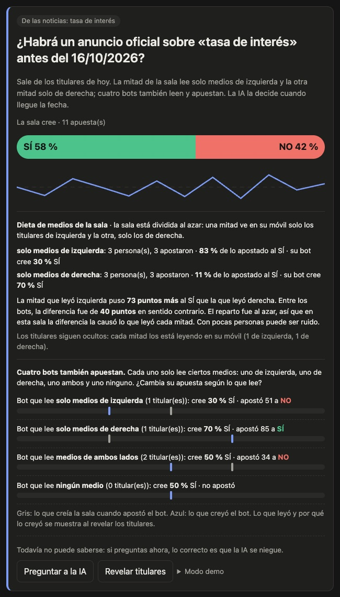
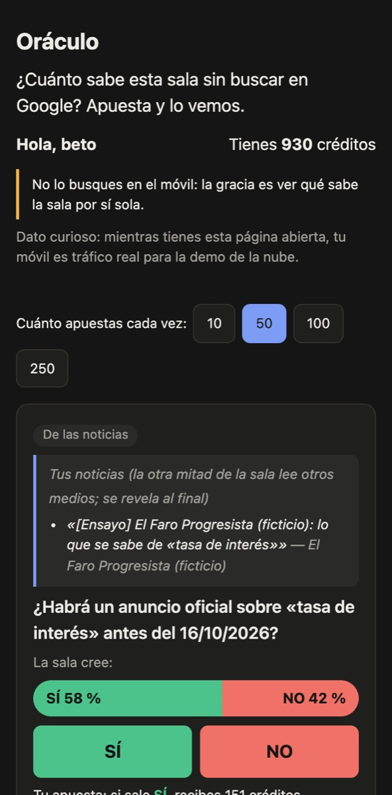
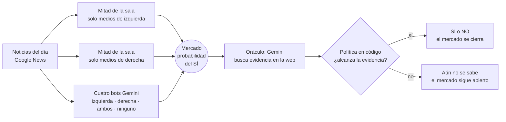
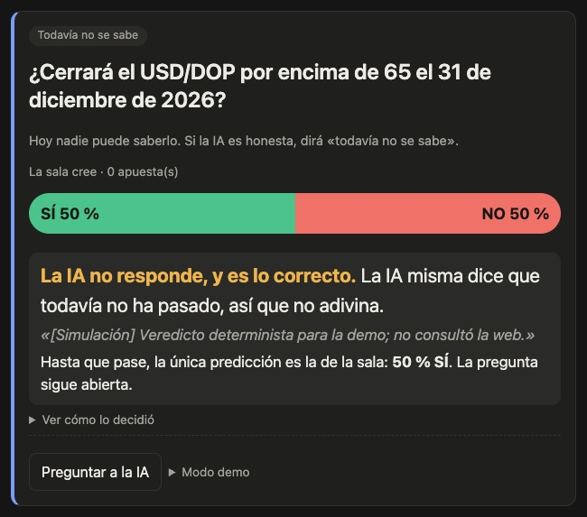
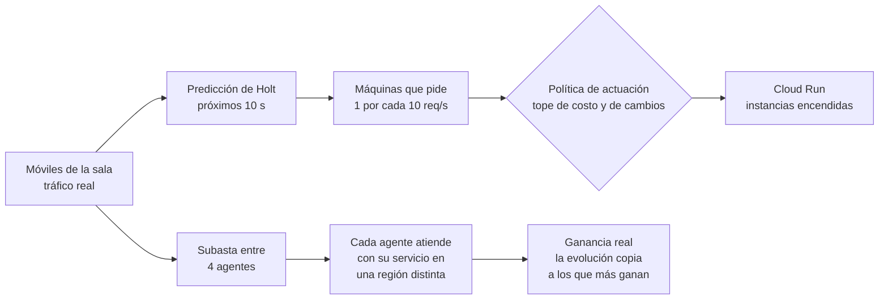
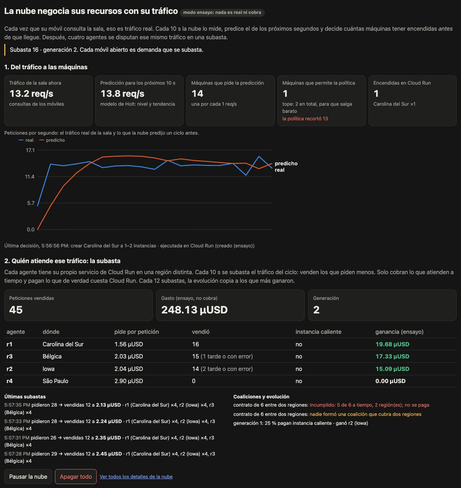

<h1 align="center">Oráculo</h1>

<p align="center">
  <strong>¿Cómo influyen los medios en lo que cree la gente y en lo que concluye una IA?</strong><br>
  Un mercado de predicción en vivo para ponerlo a prueba con una sala real, agentes de IA y Google Cloud.
</p>

<p align="center">
  
  
  
  
</p>

<p align="center">
  <a href="https://oraculo-api-346171942822.us-east1.run.app"><strong>Abrir la demo</strong></a> ·
  <a href="#la-pregunta">La pregunta</a> ·
  <a href="#cómo-funciona">Cómo funciona</a> ·
  <a href="#probarlo-en-cinco-minutos">Probarlo</a> ·
  <a href="#referencias">Referencias</a>
</p>

<table>
  <tr>
    <td width="62%"></td>
    <td width="38%"></td>
  </tr>
  <tr>
    <td><sub><b>La proyección.</b> Una pregunta nacida de las noticias. La mitad de la sala que leyó medios de izquierda se compara con la que leyó medios de derecha, y cada una con el bot que leyó lo mismo.</sub></td>
    <td><sub><b>El móvil.</b> Cada persona ve solo los titulares de su lado y apuesta.</sub></td>
  </tr>
</table>

<sub>Capturas en modo ensayo: los medios son ficticios y el oráculo es simulado. En producción, los titulares vienen de Google News y responde Gemini.</sub>

---

## La pregunta

Las personas y los modelos de lenguaje aprenden del mismo lugar: lo que se
publica. Oráculo pone a una sala de personas y a varios agentes de IA frente al
**mismo hecho contado de formas distintas**, les pide que digan qué creen
apostando, y mide cuánto se mueve cada uno.

La regla que atraviesa el proyecto es **el modelo propone, el código dispone**.
Un LLM es un componente no confiable, y lo interesante es ver dónde y por qué el
código le dice que no.

### Lo que dice la literatura

El proyecto parte de cuatro ideas con respaldo en la investigación. Oráculo no
las demuestra: con una sala y unos minutos no se prueba nada. Lo que hace es
**mostrar el mecanismo en vivo**, con un diseño que permite leer el resultado
con honestidad.

| Idea | Lo que dice la investigación | Cómo lo lleva Oráculo a la sala |
| --- | --- | --- |
| **1. Cómo se cuenta un hecho cambia lo que la gente cree** | Una misma decisión, presentada de dos maneras, produce elecciones distintas [[1]](#ref-1). Los medios seleccionan y resaltan aspectos de la realidad [[2]](#ref-2)[[3]](#ref-3) y fijan de qué se habla [[4]](#ref-4). Hay efectos causales medibles fuera del laboratorio: donde llegó Fox News, subió el voto republicano [[5]](#ref-5) | La sala se divide **al azar**: cada mitad lee titulares distintos sobre el mismo hecho. Por ser al azar, la diferencia entre mitades la causa lo que leyeron |
| **2. Lo que lee un modelo cambia lo que concluye** | Los modelos heredan la inclinación política de los medios con que se entrenan [[6]](#ref-6) y sus opiniones no representan por igual a todos los grupos [[7]](#ref-7). Ante evidencia externa coherente, la adoptan aunque contradiga lo que sabían [[8]](#ref-8), y se distraen con contexto irrelevante [[9]](#ref-9) | Cuatro agentes Gemini leen la cobertura con dietas distintas: solo izquierda, solo derecha, ambos lados o ninguno. El oráculo se consulta con y sin titular, y si cambia de respuesta, el código la rechaza |
| **3. Una multitud agrega mejor que un individuo** | En una feria, la mediana de casi 800 estimaciones del peso de un buey quedó a menos del 1 % del peso real [[10]](#ref-10). Los precios agregan conocimiento disperso que nadie tiene completo [[11]](#ref-11), y los mercados de predicción lo convierten en probabilidades útiles [[12]](#ref-12)[[13]](#ref-13). Con LLM pasa algo parecido: un conjunto de modelos rivaliza con una multitud humana [[14]](#ref-14) y un modelo con búsqueda se acerca a pronosticadores expertos [[15]](#ref-15) | La sala apuesta en un mercado con la regla de puntuación logarítmica de Hanson [[16]](#ref-16). La barra es la probabilidad que le da la sala en conjunto: su predicción |
| **4. Lo que lee un modelo puede manipularlo** | Un texto que el modelo recupera puede contener instrucciones y tomar el control de una aplicación [[17]](#ref-17) | Los titulares le llegan al modelo como datos no confiables, nunca como instrucciones. Una política en código exige confianza, fuentes independientes y que el veredicto no dependa del titular. Ante la duda, no decide |

---

## Cómo funciona



Hay dos momentos:

1. **Predecir.** Mientras el hecho no se sabe, la barra es la predicción: la
   probabilidad que le dan la sala y los bots en conjunto.
2. **Verificar.** Cuando el hecho ya pasó, el oráculo busca la respuesta con
   fuentes y el código decide si acepta lo que dice.

Si se le pregunta al oráculo **antes** de que el hecho ocurra, lo correcto es
que se niegue. No es un fallo: es lo que se quiere ver.

<p align="center">
  
  <br><sub>Una pregunta sobre el 31 de diciembre de 2026. La IA no responde, y la proyección explica por qué eso es lo correcto.</sub>
</p>

---

## Medios, gente e IA

| Qué se pregunta | Cómo se mide | Qué se ve en la proyección |
| --- | --- | --- |
| ¿Un titular cambia lo que cree **la gente**? | La sala se divide al azar en dos grupos. Cada grupo lee un titular distinto sobre el mismo hecho y apuesta | Qué parte de lo apostado por cada grupo fue al SÍ, y la diferencia en puntos |
| ¿Lo que lee **la gente** cambia lo que cree? | En las preguntas que nacen de las noticias, la sala se divide al azar: una mitad ve en su móvil solo los titulares de medios de izquierda y la otra, solo los de derecha | Qué parte de lo apostado por cada mitad fue al SÍ, junto a lo que creyó el bot que leyó lo mismo |
| ¿Un titular cambia lo que concluye **la IA**? | El oráculo responde tres veces: sin titular, con el que empuja al SÍ y con el que empuja al NO. Si su respuesta cambia con la redacción, el código la rechaza, porque los hechos eran los mismos | Las tres respuestas y si se aceptó el veredicto |
| ¿Lo que lee una IA cambia lo que **cree**? | Cuatro agentes Gemini reciben la cobertura del día filtrada por su dieta: solo medios de izquierda, solo de derecha, de ambos lados o ninguno. Cada uno da una probabilidad y apuesta | Qué probabilidad le dio cada agente al SÍ y cuánto apostó; al revelar, qué leyó y por qué |

Así se comparan directamente la mitad de la sala que leyó izquierda con el bot
que leyó izquierda, y lo mismo con derecha. Los titulares y el razonamiento de
los bots no salen en la proyección hasta pulsar «Revelar titulares», para no
contaminar a la otra mitad.

**Nada se inventa sobre terceros.** Los titulares vienen de Google News, que los
atribuye a cada medio; el modelo solo elige cuáles, por su número, y nunca los
escribe. La inclinación de cada medio no la decide el código ni el modelo: viene
de fuentes publicadas [[18]](#ref-18) que la pantalla cita.

### Cómo leer un resultado

- **Con una sala, una diferencia chica puede ser ruido.** Con pocas decenas de
  personas, unos puntos entre grupos no prueban nada. La pantalla lo dice.
- **Un LLM no es una hoja en blanco.** Trae lo que aprendió al entrenarse
  [[6]](#ref-6)[[7]](#ref-7). En una prueba sobre inmigración, las cuatro dietas
  creyeron entre 80 y 88 %. En otra, sobre el Nobel de la Paz 2026, los agentes
  que leyeron noticias de cualquier lado creyeron entre 75 y 80 %, y el agente
  sin noticias, 2 %, porque no sabía que la premiada ya había ganado. A veces los
  medios mueven la opinión de la IA, y a veces solo le dan los hechos.
- **El orden importa.** Los agentes apuestan uno tras otro y el último deja la
  barra donde él cree. La pantalla lo dice.
- **Izquierda y derecha es una simplificación.** La lista es binaria y mide cómo
  perciben las audiencias a cada medio, no su calidad.

### Lo que todavía no mide

- **Las preguntas con un titular a favor y otro en contra** se crean por API con
  titulares reales y su enlace, sin un botón en la proyección.
- **Los bots apuestan en el mismo mercado que la sala**, así que la barra que
  ven las dos mitades ya incluye lo que apostaron los bots. La comparación limpia
  es la de qué apostó cada mitad, no la barra.

Los detalles de cada pieza están en [Noticias, encuadre y opinión](docs/NOTICIAS.md).

---

## La nube negocia sus recursos con el tráfico

Los móviles de la sala son la demanda real: cada consulta que hace un móvil que
entró a la sala cuenta como tráfico. Cada 10 s, la nube hace dos cosas con ese
tráfico, y la proyección muestra las dos.



**1. Del tráfico a las máquinas.** Es autoescalado predictivo [[19]](#ref-19)[[20]](#ref-20):
la nube no espera a que llegue el tráfico para encender máquinas, sino que lo
predice con el método de Holt [[21]](#ref-21) y enciende capacidad antes.

| Paso | Qué pasa |
| --- | --- |
| Tráfico de la sala | Se miden las peticiones por segundo del último ciclo |
| Predicción | Holt (nivel y tendencia) predice las de los próximos 10 s. La gráfica pone lo real junto a lo que predijo un ciclo antes |
| Máquinas que pide | Una instancia mínima de Cloud Run por cada 10 req/s previstas (`INFRA_RPS_POR_INSTANCIA`), encendida **antes** de que llegue el tráfico para evitar arranques en frío |
| Máquinas que permite la política | `ActuationPolicy` recorta lo pedido a lo que la cuenta permite: 2 instancias mínimas en total, regiones permitidas y un cambio por minuto por región. Si recorta, la pantalla lo dice |
| Encendidas en Cloud Run | Lo que de verdad hay encendido, por región, y la última decisión: ejecutada o bloqueada, con su motivo |

**2. Quién atiende ese tráfico.** Es un mercado de recursos al estilo de los que
propone la computación orientada a mercados [[22]](#ref-22)[[23]](#ref-23). El
tráfico del ciclo, hasta 12 peticiones, se subasta entre cuatro agentes. Cada
agente opera su propio servicio de Cloud Run en una región distinta. Venden los
que piden menos, cobran solo lo que atienden a tiempo y pagan el costo real de
Cloud Run, con precios del catálogo de Cloud Billing. Cada agente ajusta su
margen con Q-learning, como en los estudios de precios algorítmicos
[[24]](#ref-24). Cada 6 subastas se ofrece un contrato que exige dos regiones, y
lo cobrado se reparte por valor de Shapley [[25]](#ref-25). Cada 12, la
evolución copia a los agentes que más ganaron. Es una versión mínima de la
computación autónoma [[26]](#ref-26): un sistema que se configura, se optimiza y
se repara solo.

<p align="center">
  
  <br><sub>La sección de la nube en la proyección, en modo ensayo: el tráfico, la predicción, lo que pide, lo que permite la política y la subasta.</sub>
</p>

Lo que esto es y lo que no:

- **Es real:** el tráfico, las instancias, los servicios de los agentes y sus
  costos, en Cloud Run. Una hora de mercado cuesta alrededor de un centavo.
- **Es pequeño a propósito:** con el tráfico de una sala y un tope de 2
  instancias, el escalado se nota en unidades, no en cientos.
- **No es descentralizado:** hay un subastador central y el dinero de los
  agentes es contable. Los detalles, en [La nube autónoma](docs/NUBE.md).

Para verlo, quien modera pulsa «Arrancar la nube» en la proyección y la sala abre
la página en el móvil. Si nadie mira la proyección ni `/nube.html` durante 30
minutos, la vigilia borra los servicios.

---

## Qué hace

| Parte | Qué pasa | Más |
| --- | --- | --- |
| **Creencia contra evidencia** | La sala apuesta sobre preguntas que nadie sabe con certeza. Gemini busca evidencia en la web y una política en código acepta o rechaza su veredicto. Los rechazos se pueden provocar a propósito para verlos | [Tipos de pregunta](docs/PREGUNTAS.md) |
| **Noticias y opinión** | La sala se divide al azar y cada mitad lee titulares distintos sobre el mismo hecho. Las preguntas también pueden nacer de las noticias del día, con cuatro agentes que solo leen medios de izquierda, solo de derecha, ambos o ninguno, y apuestan en el mismo mercado | [Noticias, encuadre y opinión](docs/NOTICIAS.md) |
| **Nube autónoma** | Bucles que actúan sobre Cloud Run de verdad: despliegan la topología que propone un modelo, escalan con el tráfico de los móviles, reparan fallas reales y tienen un mercado de agentes con precios reales. En local, un laboratorio simulado muestra lo mismo a cámara rápida | [La nube autónoma](docs/NUBE.md) |

Hay tres pantallas:

| Pantalla | Quién la ve | Para qué |
| --- | --- | --- |
| `/` | Cada persona, en su móvil | Entrar con el código de sala, leer sus titulares, apostar y responder el censo |
| `/proyeccion.html` | Todos, en una pantalla compartida | Ver los mercados, el código de sala y la nube negociando con el tráfico; quien modera consulta al oráculo, crea preguntas desde las noticias, revela los titulares y arranca o apaga la nube |
| `/nube.html` | Quien modera | Todos los detalles de la nube: topologías, nodos, fallas reales y la política de actuación |

Los controles de moderación aparecen solo si la URL termina en `#clave=…`.

---

## Probarlo en cinco minutos

Requiere Python 3.12 o superior. Sin credenciales de Google Cloud, todo corre en
modo de ensayo: oráculo simulado, medios ficticios y nada que cobre. **En
producción no hay nada simulado:** la API no arranca si el oráculo, las noticias,
la infraestructura o las preguntas no son reales.

```bash
python -m venv .venv
source .venv/bin/activate              # Windows: .venv\Scripts\activate
pip install --require-hashes -r requirements-dev.lock   # versiones fijadas y verificadas por hash
pre-commit install                     # controles de seguridad antes de cada commit
cp .env.example .env

pytest -q
uvicorn app.main:app --reload --port 8080
```

Abre la proyección en http://localhost:8080/proyeccion.html: ahí aparece el
código de sala. Con ese código, entra desde http://localhost:8080 (o desde otra
pestaña). La nube está en http://localhost:8080/nube.html. Más formas de
ensayar, incluida la infraestructura simulada, en
[CODIGO.md](docs/CODIGO.md#ensayar-sin-tocar-la-nube).

---

## Documentación

| Documento | Qué tiene |
| --- | --- |
| [Tipos de pregunta](docs/PREGUNTAS.md) | Qué mide cada tipo de pregunta, los juegos de preguntas (`SEED_SET`) y los fallos del oráculo que se pueden provocar |
| [Noticias, encuadre y opinión](docs/NOTICIAS.md) | El experimento de los dos titulares, la sala con dieta de medios, la prueba del oráculo, los agentes y la lista de medios con sus fuentes |
| [La nube autónoma](docs/NUBE.md) | Qué es real y qué es laboratorio, las dos compuertas y el mercado real con números medidos |
| [El código](docs/CODIGO.md) | Capas, estructura, tests, cómo ensayar y las decisiones de diseño |
| [Arquitectura](docs/ARQUITECTURA.md) | Diagramas C4, secuencias y fronteras de confianza |
| [Despliegue](docs/DESPLIEGUE.md) | Costos, permisos, primer despliegue, publicar cambios y limpieza |
| [Seguridad](SECURITY.md) | Modelo de amenazas, cada control con el test que lo fija y los riesgos aceptados |

---

## Cómo está hecho

<p align="center">
  
</p>

- **Arquitectura limpia.** El dominio (mercado LMSR, políticas, agentes) no
  importa nada de I/O. Vertex AI, Cloud Run, Google News y la memoria son
  adaptadores detrás de puertos. Un test hace cumplir la regla de dependencias.
- **Fail-closed.** Ante un error de red, una respuesta ilegible, poca confianza
  o pocas fuentes, el veredicto queda SIN RESOLVER y el mercado sigue abierto.
- **Nada inventado sobre terceros.** Los titulares de medios reales vienen de
  Google News, nunca del texto del modelo. La inclinación de cada medio cita una
  fuente publicada. Lo simulado dice que es simulado.
- **Costo acotado.** Sin procesos en segundo plano, con escala a cero, topes en
  código, una vigilia que borra lo olvidado y un presupuesto de 10 USD al mes.
  Una hora de mercado real cuesta alrededor de un centavo.
- **Seguridad en cada paso.** Código de sala para entrar, clave de moderación en
  Secret Manager, CSP estricta, identidades con permisos mínimos (también para el
  pipeline), dependencias e imágenes fijadas por hash, y un pipeline que corre
  gitleaks, bandit, pip-audit, la suite completa y Trivy antes de publicar.
- **Publicación continua.** Cada push a `master` pasa por ese pipeline y se
  publica en Cloud Run. La sala sobrevive a que la API escale a cero gracias a
  una foto firmada del estado en Cloud Storage (ver
  [Despliegue](docs/DESPLIEGUE.md#el-estado-sobrevive-a-la-escala-a-cero)).

---

## Referencias

**Medios, encuadre y opinión**

1. <a id="ref-1"></a>Tversky, A. y Kahneman, D. (1981). The framing of decisions and the psychology of choice. *Science*, 211(4481), 453–458. [doi:10.1126/science.7455683](https://doi.org/10.1126/science.7455683)
2. <a id="ref-2"></a>Entman, R. M. (1993). Framing: Toward clarification of a fractured paradigm. *Journal of Communication*, 43(4), 51–58. [doi:10.1111/j.1460-2466.1993.tb01304.x](https://doi.org/10.1111/j.1460-2466.1993.tb01304.x)
3. <a id="ref-3"></a>Chong, D. y Druckman, J. N. (2007). Framing theory. *Annual Review of Political Science*, 10, 103–126. [doi:10.1146/annurev.polisci.10.072805.103054](https://doi.org/10.1146/annurev.polisci.10.072805.103054)
4. <a id="ref-4"></a>McCombs, M. E. y Shaw, D. L. (1972). The agenda-setting function of mass media. *Public Opinion Quarterly*, 36(2), 176–187. [doi:10.1086/267990](https://doi.org/10.1086/267990)
5. <a id="ref-5"></a>DellaVigna, S. y Kaplan, E. (2007). The Fox News effect: Media bias and voting. *The Quarterly Journal of Economics*, 122(3), 1187–1234. [doi:10.1162/qjec.122.3.1187](https://doi.org/10.1162/qjec.122.3.1187)

**Modelos de lenguaje, sesgo y evidencia**

6. <a id="ref-6"></a>Feng, S., Park, C. Y., Liu, Y. y Tsvetkov, Y. (2023). From pretraining data to language models to downstream tasks: Tracking the trails of political biases leading to unfair NLP models. *ACL 2023*. [aclanthology.org/2023.acl-long.656](https://aclanthology.org/2023.acl-long.656)
7. <a id="ref-7"></a>Santurkar, S., Durmus, E., Ladhak, F., Lee, C., Liang, P. y Hashimoto, T. (2023). Whose opinions do language models reflect? *ICML 2023*. [arXiv:2303.17548](https://arxiv.org/abs/2303.17548)
8. <a id="ref-8"></a>Xie, J., Zhang, K., Chen, J., Lou, R. y Su, Y. (2024). Adaptive chameleon or stubborn sloth: Revealing the behavior of large language models in knowledge conflicts. *ICLR 2024*. [arXiv:2305.13300](https://arxiv.org/abs/2305.13300)
9. <a id="ref-9"></a>Shi, F., Chen, X., Misra, K., Scales, N., Dohan, D., Chi, E., Schärli, N. y Zhou, D. (2023). Large language models can be easily distracted by irrelevant context. *ICML 2023*. [arXiv:2302.00093](https://arxiv.org/abs/2302.00093)

**Agregación y mercados de predicción**

10. <a id="ref-10"></a>Galton, F. (1907). Vox populi. *Nature*, 75, 450–451. [doi:10.1038/075450a0](https://doi.org/10.1038/075450a0)
11. <a id="ref-11"></a>Hayek, F. A. (1945). The use of knowledge in society. *The American Economic Review*, 35(4), 519–530. [jstor.org/stable/1809376](https://www.jstor.org/stable/1809376)
12. <a id="ref-12"></a>Wolfers, J. y Zitzewitz, E. (2004). Prediction markets. *Journal of Economic Perspectives*, 18(2), 107–126. [doi:10.1257/0895330041371321](https://doi.org/10.1257/0895330041371321)
13. <a id="ref-13"></a>Arrow, K. J. et al. (2008). The promise of prediction markets. *Science*, 320(5878), 877–878. [doi:10.1126/science.1157679](https://doi.org/10.1126/science.1157679)
14. <a id="ref-14"></a>Schoenegger, P., Tuminauskaite, I., Park, P. S., Valdece Sousa Bastos, R. y Tetlock, P. E. (2024). Wisdom of the silicon crowd: LLM ensemble prediction capabilities rival human crowd accuracy. *Science Advances*, 10(45). [arXiv:2402.19379](https://arxiv.org/abs/2402.19379)
15. <a id="ref-15"></a>Halawi, D., Zhang, F., Yueh-Han, C. y Steinhardt, J. (2024). Approaching human-level forecasting with language models. *NeurIPS 2024*. [arXiv:2402.18563](https://arxiv.org/abs/2402.18563)
16. <a id="ref-16"></a>Hanson, R. (2003). Combinatorial information market design. *Information Systems Frontiers*, 5(1), 107–119.

**Seguridad de aplicaciones con LLM**

17. <a id="ref-17"></a>Greshake, K., Abdelnabi, S., Mishra, S., Endres, C., Holz, T. y Fritz, M. (2023). Not what you've signed up for: Compromising real-world LLM-integrated applications with indirect prompt injection. *AISec '23 (ACM CCS Workshops)*. [arXiv:2302.12173](https://arxiv.org/abs/2302.12173)

**La lista de medios**

18. <a id="ref-18"></a>Masip, P., Suau, J. y Ruiz-Caballero, C. (2020). *Profesional de la información*, 29(5). [doi:10.3145/epi.2020.sep.27](https://doi.org/10.3145/epi.2020.sep.27). También: CIS, *Estudio sobre audiencias de medios de comunicación social* (noviembre de 2023), y AllSides, *Media Bias Chart* (2024). Detalle en [NOTICIAS.md](docs/NOTICIAS.md#la-lista-de-medios).

**Nube autónoma**

19. <a id="ref-19"></a>Roy, N., Dubey, A. y Gokhale, A. (2011). Efficient autoscaling in the cloud using predictive models for workload forecasting. *IEEE CLOUD 2011*. [computer.org](https://computer.org/csdl/proceedings-article/cloud/2011/4460a500/12OmNxWcH9P)
20. <a id="ref-20"></a>Lorido-Botran, T., Miguel-Alonso, J. y Lozano, J. A. (2014). A review of auto-scaling techniques for elastic applications in cloud environments. *Journal of Grid Computing*, 12(4), 559–592. [doi:10.1007/s10723-014-9314-7](https://doi.org/10.1007/s10723-014-9314-7)
21. <a id="ref-21"></a>Holt, C. C. (2004). Forecasting seasonals and trends by exponentially weighted moving averages. *International Journal of Forecasting*, 20(1), 5–10 (reimpresión del informe de 1957). [doi:10.1016/j.ijforecast.2003.09.015](https://doi.org/10.1016/j.ijforecast.2003.09.015)
22. <a id="ref-22"></a>Buyya, R., Yeo, C. S., Venugopal, S., Broberg, J. y Brandic, I. (2009). Cloud computing and emerging IT platforms: Vision, hype, and reality for delivering computing as the 5th utility. *Future Generation Computer Systems*, 25(6), 599–616. [doi:10.1016/j.future.2008.12.001](https://doi.org/10.1016/j.future.2008.12.001)
23. <a id="ref-23"></a>Wolski, R., Plank, J. S., Brevik, J. y Bryan, T. (2001). Analyzing market-based resource allocation strategies for the computational grid. *International Journal of High Performance Computing Applications*, 15(3), 258–281.
24. <a id="ref-24"></a>Calvano, E., Calzolari, G., Denicolò, V. y Pastorello, S. (2020). Artificial intelligence, algorithmic pricing, and collusion. *American Economic Review*, 110(10), 3267–3297. [doi:10.1257/aer.20190623](https://doi.org/10.1257/aer.20190623)
25. <a id="ref-25"></a>Shapley, L. S. (1953). A value for n-person games. En *Contributions to the Theory of Games II* (Annals of Mathematics Studies 28), 307–317. Princeton University Press.
26. <a id="ref-26"></a>Kephart, J. O. y Chess, D. M. (2003). The vision of autonomic computing. *Computer*, 36(1), 41–50. [doi:10.1109/MC.2003.1160055](https://doi.org/10.1109/MC.2003.1160055)
