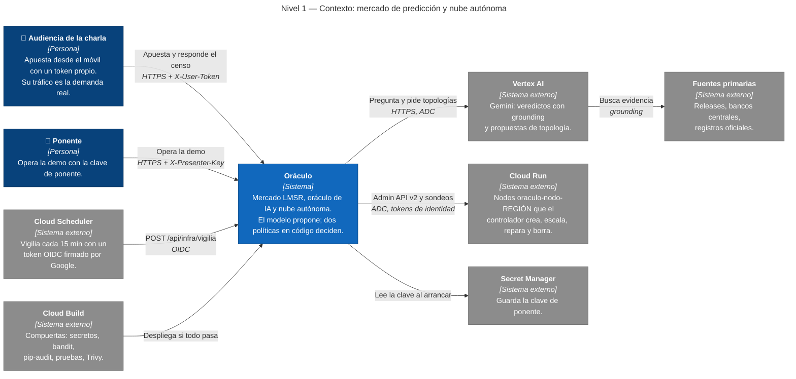
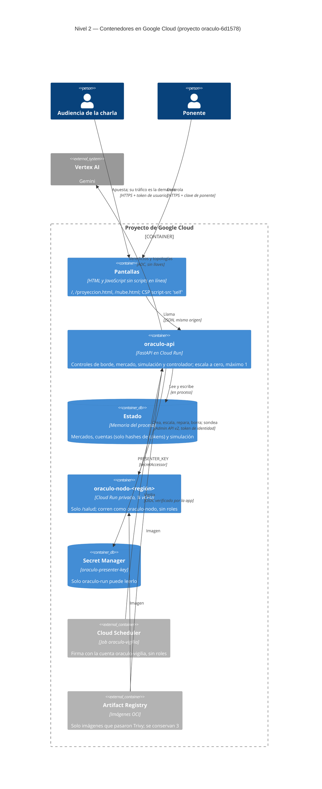
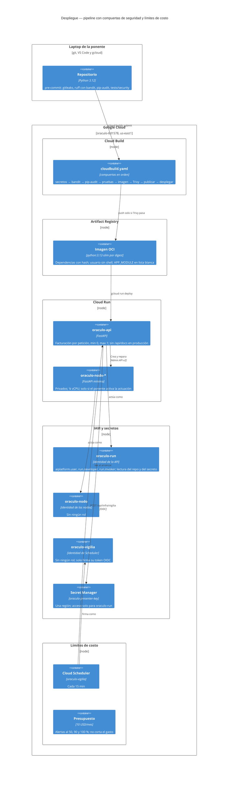
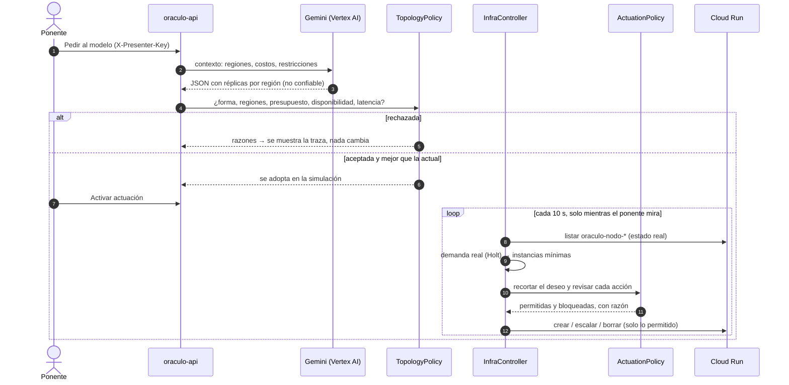
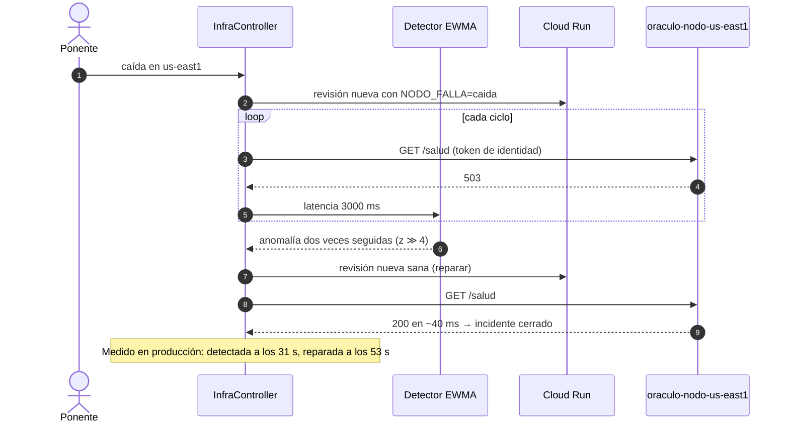

# Arquitectura

Cómo está construido Oráculo, de afuera hacia adentro: contexto, contenedores,
componentes y despliegue (modelo C4), dos flujos clave y las fronteras de
confianza. Para *por qué* existe la demo y qué afirmar con ella, ver el
[README](../README.md); para las amenazas y los controles, ver
[SECURITY.md](../SECURITY.md).

Los diagramas viven en `docs/*.mmd`, que son la fuente de verdad. Este documento
los copia en bloques `mermaid`, que GitHub renderiza solo. Si editas un `.mmd`,
corre `make diagramas`: `tests/test_docs.py` falla si este documento quedó viejo.

## 1. Contexto

Quién usa el sistema y de qué sistemas externos depende.


[Abrir y editar en mermaid.live](https://mermaid.live/edit#pako:eNqNVn9v2zYQ_SoHFwUWTE7ixMkMLwjgOl0WLL8QZ8WAqn-cyJPDlSJVUvTmFf3uO4qSnSzpEBiwLd7du8fju6O-DoSVNJjCYDgc5qZRjaYp5INrtSINI8jDwf5oDHNrGvq7sVOoyAmUFiRB7UgqIVQe9vfLQwNrMKEgwNB0K7bCfJCbFvntWzhTuHRYYYwVHSDMxyBVEf6MmMJWFkpt_xIP6JopMAONaxua6GWwUas27xW5CpVsMbFiIGuQHT1Qo74EatDvMmFtHXkOnEJNzkeXH_CfoMF6EZzdycAr3xCzqZ2tlU3WnaxF7U3MkJxh29Ipv7Obmw05uLzLDUAdCq2E_cjbDHJyKPlbHB_BSXE6C1KREardrUaIURpP9orTk8LtnZ6o04-3idenkz2VFmd1IN_ECM9BvPsqFXKldCwYBAON_Uymo7zbBi0CNC760ahkKsCb1hGiQiMRHKHezQefWrLWEFe9Jyv4u8RxJHubLP_P7obriB22bfnEbWlcUSuGBJFyxWzWoQg6loYT3HQM48qTLItU6W2Wq05fl1eLu4xBtnExy8XsRZWlSrzngrGY2TPWh_n8DNJ6ZqZbENkoEUViQKRIqZYRVChJZst7RY6VmWh_aP_D7OIlzr06ttzPqVJGTSNE7IyGk8cyLZ0NRiqzbJ3WLbv2oH3cUsNUtV0mitifVRliNX2i8Ut64EBVoVPoX0fnjjShJ59BgUZEMgzjUPNKa3e05FDHBsvKUdHQpxfaBumCSfnn8Qnugnld3msby96d_9Dw0_Du_flF3KE8vAZuUdZ26xmngLOaz9uBYKlmrF6Bmn8d1chqW0NhndtUxRN7cVkTrUX7BFdocEnulUcU0En8vnI5h3ggGTS5x3tf9Iuvy_JBLZXm1mclI4yOgGXRNXBrTk18c3E2h1LxLGO511yBc2uXesOjCErLxxzexYXX5Z_bihXmWGHTTc1aFUjVpLOvVT3EEB9ZVYEKZPu9U6v1thG62QbDId8H_Wha88l4rliaTywob3s6v97f3y7gR_hj-LsnN7yPm4yM8gFDnPZ6eDSIEvKTsfIc65bzRWc3_I3WL8N1fxMc-y-DaZnW6ll7-ScJMpidzR9hptbfDoGE-C6wJoFWcUxwl_QI267eAnRd-4zUTEYFzG4vYHXAxHysn91wYRJZGuztQIh5GiVRPgLu-_EZ8iXRVsyoAblbjEDXxfWH_0TYXaFuFvewh7XaU6Z0uLdKmu1JRXW-XO5WmAnjjLWgFS2Rb0zeQdQxevxvSBoo6P0ZlZvLuFRaT9_sT8YHPxVZnEKfiR-PDujoOBPx8p6-KcvySWh_K6fQ0eh4UshtaDGeTMbfC-0v8hQ6EfGzCT0u4uel0L4Hsl6xHfutQ38YHbetISko6xSR9QeYbdpxcxxZKmhHMTeDDAZVesWJ72Vf80HzQBXlg_heJqnEoJt88C268SVoF2sj2NRwF_NKqCU21L1pdcvf_gU6QlzC) · [SVG](c4-nivel1-contexto.svg) · [fuente](c4-nivel1-contexto.mmd)

<details>
<summary>Fuente Mermaid del diagrama de contexto</summary>

<!-- mmd:c4-nivel1-contexto -->

<!-- /mmd -->

</details>

Lo esencial está en el centro: **el modelo propone y el código dispone**.
Gemini propone veredictos y topologías; nada llega a la audiencia ni a Cloud
Run sin pasar por una política escrita en Python.

## 2. Contenedores

Qué se ejecuta, dónde y cómo se habla. Todo vive en un proyecto de Google Cloud
(`oraculo-6d1578`, `us-east1`).

<!-- mmd:c4-nivel2-contenedores -->

<!-- /mmd -->

| Contenedor | Por qué así |
| --- | --- |
| `oraculo-api` | Una sola instancia (`max 1`) porque el estado vive en memoria; escala a cero y cobra por petición |
| `oraculo-nodo-<región>` | La misma imagen con `APP_MODULE=app.node:app`; privados (requieren token de identidad); ¼ de vCPU |
| Secret Manager | La única credencial propia es la clave de ponente; todo lo demás usa identidades de Google (ADC, OIDC) |
| Cloud Scheduler | La vigilia: el único gasto que no se apaga solo son los nodos olvidados |

## 3. Componentes de `oraculo-api`

Clean architecture: las dependencias apuntan hacia adentro y
`tests/test_architecture.py` lo verifica en cada commit.

```mermaid
C4Component
  title Nivel 3 — Componentes de oraculo-api (clean architecture)

  Container_Boundary(api, "oraculo-api (FastAPI)") {
    Component(http, "Entrypoint HTTP", "entrypoints/http/api.py", "Rutas y controles de borde: clave de ponente, token de usuario, OIDC, CSP y cabeceras")
    Component(esquemas, "Esquemas", "entrypoints/http/schemas.py", "Pydantic: longitudes, patrones de nombre y región")
    Component(limites, "Límites de abuso", "application/limits.py", "Ventana deslizante: órdenes por persona y entradas por minuto")
    Component(raiz, "Raíz de composición", "main.py · config.py · seeds.py", "Lee el entorno y conecta las capas")
    Component(servicio, "Casos de uso", "application/service.py", "Entrar, operar, censo, resolver; autentica con hash del token")
    Component(puertos, "Puertos", "application/ports.py", "OracleGateway, Repository y catálogo de fallos")
    Component(dominio, "Dominio", "domain/", "Market, Account, LMSR, AcceptancePolicy, CensusPolicy")
    Component(memoria, "Repositorio en memoria", "adapters/memory.py", "Implementa Repository con un lock")
    Component(ruta, "Ruta común Gemini", "adapters/oracle/gemini.py", "run · inject_fault · interpret")
    Component(vertexad, "Adaptador Vertex AI", "adapters/oracle/vertex.py", "generateContent con grounding")
    Component(mock, "Adaptador simulado", "adapters/oracle/mock.py", "Payload con la misma forma, sin red")
    Component(nube, "Caso de uso de la nube", "application/cloud.py", "Avance perezoso por reloj, fallas, topologías, juez")
    Component(sim, "Nube simulada", "domain/cloud/", "Holt-Winters, Q-learning, Shapley, GA, EWMA, TopologyPolicy")
    Component(gentopo, "Generadores de topologías", "adapters/topology/", "Gemini y simulado; ninguno decide")
    Component(infra, "Controlador de infraestructura", "application/infra.py", "Observa, predice con Holt, sondea, repara; corre dentro de GET /api/infra")
    Component(actuacion, "ActuationPolicy", "domain/cloud/infra.py", "Regiones, topes de instancias, ritmo de cambios; recorta y revisa")
    Component(gwrun, "Adaptador Cloud Run", "adapters/infra/cloudrun.py", "Admin API v2; solo oraculo-nodo-* con etiqueta propia")
    Component(gwfake, "Nube de ensayo", "adapters/infra/fake.py", "Se comporta como Cloud Run, en memoria")
  }

  System_Ext(cloudrun, "Cloud Run", "Nodos reales")

  System_Ext(vertex, "Vertex AI", "Gemini con grounding")

  Rel(raiz, http, "Construye")
  Rel(raiz, servicio, "Inyecta puertos y políticas")
  Rel(http, esquemas, "Valida la entrada")
  Rel(http, servicio, "Invoca casos de uso")
  Rel(servicio, limites, "Pide permiso antes de escribir")
  Rel(servicio, puertos, "Depende de")
  Rel(servicio, dominio, "Aplica reglas")
  Rel(memoria, puertos, "Implementa Repository")
  Rel(vertexad, puertos, "Implementa OracleGateway")
  Rel(mock, puertos, "Implementa OracleGateway")
  Rel(vertexad, ruta, "Payload")
  Rel(mock, ruta, "Payload")
  Rel(ruta, dominio, "AcceptancePolicy decide")
  Rel(vertexad, vertex, "generateContent", "HTTPS/JSON")
  Rel(http, nube, "Controles del ponente")
  Rel(servicio, nube, "Resuelve preguntas 'simulacion'")
  Rel(nube, sim, "Avanza y consulta")
  Rel(gentopo, puertos, "Implementa TopologyGenerator")
  Rel(gentopo, vertex, "generateContent", "HTTPS/JSON")
  Rel(http, infra, "Ciclo, fallas, apagado, vigilia")
  Rel(infra, nube, "Lee la topología adoptada")
  Rel(infra, actuacion, "Recorta el deseo y revisa cada acción")
  Rel(gwrun, puertos, "Implementa NodeGateway")
  Rel(gwfake, puertos, "Implementa NodeGateway")
  Rel(gwrun, cloudrun, "Crea, escala, repara, borra; sondea", "HTTPS")

  UpdateLayoutConfig($c4ShapeInRow="3", $c4BoundaryInRow="1")
```

<!-- mmd:c4-nivel3-componentes -->

<!-- /mmd -->

| Capa | Contiene | Puede importar |
| --- | --- | --- |
| `domain/` | Mercado, LMSR, políticas (`AcceptancePolicy`, `CensusPolicy`, `TopologyPolicy`, `ActuationPolicy`), simulación | solo `domain` |
| `application/` | Casos de uso, puertos, límites de abuso, controlador de infraestructura | `domain` |
| `adapters/` | Vertex AI, Cloud Run, repositorio en memoria, nube de ensayo | `domain`, `application` |
| `entrypoints/http/` | FastAPI, esquemas, controles de borde, pantallas | `domain`, `application` |
| `main.py`, `config.py` | Raíz de composición: lee el entorno, falla cerrado y conecta todo | todo |

## 4. Despliegue

Del commit a producción, con las compuertas de seguridad en orden.

<!-- mmd:c4-despliegue -->

<!-- /mmd -->

## 5. Flujos clave

### Del modelo a Cloud Run: dos compuertas



### Falla real y autorreparación



## 6. Fronteras de confianza

| Frontera | Qué cruza | Control | Dónde |
| --- | --- | --- | --- |
| Internet → API | Peticiones de la audiencia | Token por nombre (hash SHA-256 guardado), límites de ritmo, esquemas con patrones | `api.py`, `service.py`, `limits.py`, `schemas.py` |
| Internet → API | Acciones del ponente | `X-Presenter-Key` comparada en tiempo constante; ≥ 32 caracteres o no arranca | `api.py`, `config.py` |
| Cloud Scheduler → API | Vigilia | Token OIDC firmado por Google: firma, audiencia y cuenta | `google_auth.py`, `api.py` |
| Navegador | HTML y JS propios | CSP `script-src 'self'`, sin scripts en línea, sin `eval` | `api.py`, `static/` |
| API → Gemini | Respuestas del modelo | Dato no confiable: `AcceptancePolicy` y `TopologyPolicy` | `domain/` |
| API → Cloud Run | Acciones sobre la cuenta | `ActuationPolicy`; solo `oraculo-nodo-*` con etiqueta propia; identidad con permisos mínimos | `domain/cloud/infra.py`, `adapters/infra/cloudrun.py` |
| Código → imagen | Dependencias y sistema base | Lock con hashes, base por digest, Trivy, pip-audit | `requirements.lock`, `Dockerfile`, `cloudbuild.yaml` |

## 7. Regenerar los diagramas

```bash
make diagramas   # copia los .mmd aquí y renderiza el de contexto a PNG y SVG
```

El render usa `mermaid-cli` con el Chrome instalado (`CHROME=...` para otra
ruta). El diagrama de contexto está escrito como `flowchart` con la convención
de colores de C4, porque el layout C4 nativo de Mermaid amontona las etiquetas.
